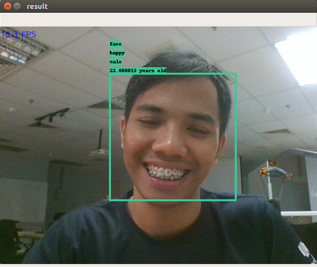
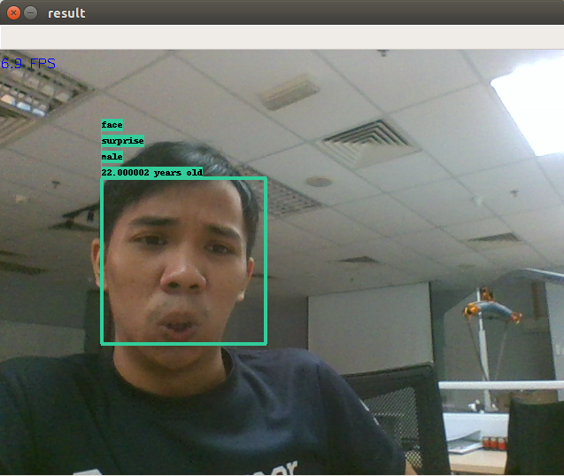
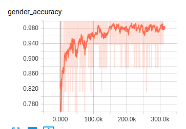
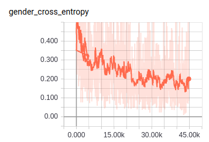
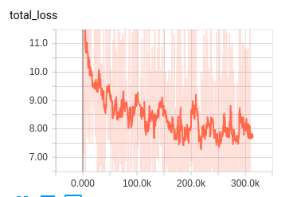

# Age-Gender-Emotion-Mobilenet
Transfer learning for age, gender and emotion classifications on mobilenet architecture in a single feed-forward!

## Requirements
```bash
pip3 install numpy scipy tensorflow
```

## How-to Prepare Datasets
1. Download this emotion dataset, https://drive.google.com/file/d/1S-OaOoIjyoaw-n8S-nXryibp6wrvsu_o/view?usp=sharing, unzip in current directory
2. Download pretrained mobilenet V2, https://drive.google.com/file/d/1pP9DH57n5CC4oBCvmNOEp87N8EK2NFTT/view?usp=sharing, and unzip in current directory
3. Download this age and gender dataset, https://data.vision.ee.ethz.ch/cvl/rrothe/imdb-wiki/static/wiki_crop.tar, unzip in current directory
4. run prepare_dataset.ipynb using Jupyter Notebook
5. run,
```bash
mkdir crop
python3 augmentation.py
```

## How-to Train
1. Run jupyter notebook,
```bash
jupyter notebook
```
2. run emotion-transfer-learning.ipynb, you can check the batch size and epoch inside the notebook.
3. run age-gender-transfer-learning.ipynb, you can check the batch and epoch inside the notebook.
4. You can check tensorboard during training session,
```bash
tensorboard --logdir=./logs
```

## To test on live camera
```bash
python3 live.py
```

## How-to use tensorflow serving
1. run,
```bash
python3 save-tf-serving.py
```
2. run,
```bash
tensorflow_model_server --port=9000 --model_name=mobilenet --model_base_path=serving/versions
```
3. run client-serving.ipynb
```python
img = imread('test/another-husein.jpg')
request.inputs['image'].CopyFrom(
  tf.contrib.util.make_tensor_proto(img.astype(dtype=np.float32), shape=img.shape))
result_future = stub.Predict(request, 30.)
print(label_genders[np.argmax(result_future.outputs['gender'].float_val)])
# male
print(label_emotions[np.argmax(result_future.outputs['emotion'].float_val)])
# surprise
print(result_future.outputs['age'].float_val[0]-9)
# 22.0
```

## You can download pretrained age-emotion-gender here, https://drive.google.com/file/d/1t--oS5G4ErLcrFcItEm-cBg8NGfssixs/view?usp=sharing

## Results





Accuracy gender during training



Entropy gender during training



Absolute loss age during training



I able to get 17 fps on GTX 970M, while CPU around 8 fps.
