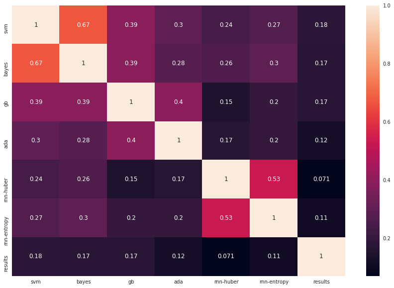
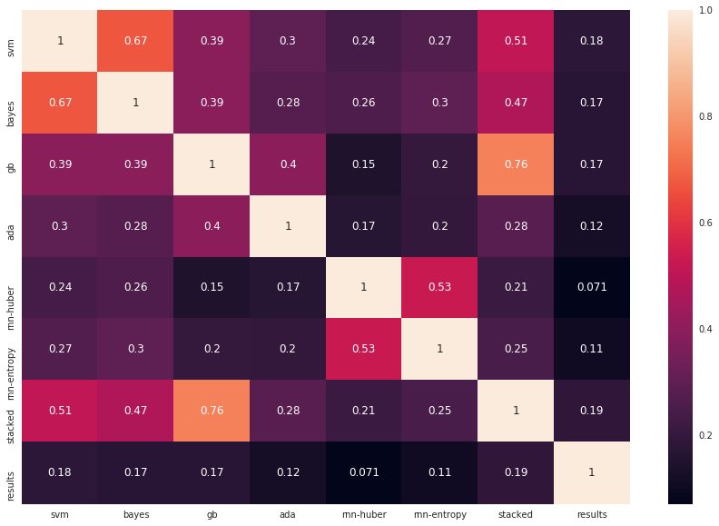
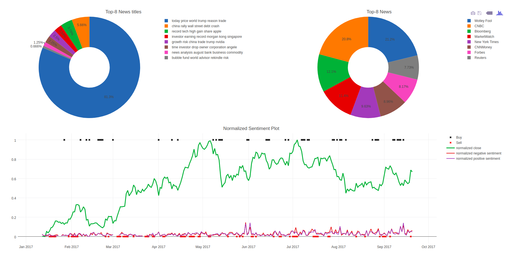

# Stack-Sentiment-Engine
Stacked 2 Deep learning models, adaptive boosting, gradient boosting, bayes and SVM with Extreme Gradient Boosting to classify news sentiment.

## Datasets

1. [Full-Economic-News-DFE-839861.csv](dataset/Full-Economic-News-DFE-839861.csv)
2. [us-economic-newspaper.csv](dataset/us-economic-newspaper.csv)

## Models

Base models are:
1. RNN + LSTM + Huber
2. RNN + LSTM + Entropy
3. Adaptive boosting
4. gradient boosting
5. Naive bayes
6. SVM

outputs from base models will concat column-wise, become features for top model, Extreme Gradient Boosting. Hyperparameters already fine-tuned using bayesian optimization.
```text
stop after 300 iteration with valid acc 0.594040
   28 | 00m09s |    0.59404 |    4.8538 |      2.0279 |             4.8653 |      6.1488 |       4.4801 |             1.3616 | 
stop after 300 iteration with valid acc 0.590557
   29 | 00m09s |    0.59056 |    0.2184 |      2.4664 |             4.7846 |      9.0458 |       1.0078 |             1.1453 | 
stop after 300 iteration with valid acc 0.594040
   30 | 00m09s |    0.59404 |    4.9786 |      2.2079 |             4.5975 |      4.7948 |       1.2136 |             1.3788 | 
Best parameters:  {'max_depth': 2.0024276362131621, 'gamma': 0.17908412443987298, 'reg_lambda': 3.3834524892572224, 'reg_alpha': 0.019426115025547031, 'min_child_weight': 0.26425441256794802, 'scale_pos_weight': 1.6203111511728578}
```

## Explanation

[text-cleaning.ipynb](text-cleaning.ipynb) will show you how I do pre-processing and text-cleaning.

[word-vector.ipynb](word-vector.ipynb) will show you how I do vectorization for sentiment searching.

[stack.ipynb](stack.ipynb) will show you how I do stacking and save those models as a unified model.

[reuse.ipynb](reuse.ipynb) will show you how to load that unified stacking model and ready to classify for any text.

## Results

Correlation results without stacking.



Correlation results with stacking.




